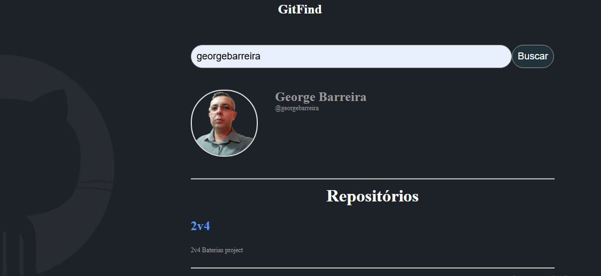

# Aplicação GitFind

Este projeto é uma aplicação simples de consumo da api do GitHub desenvolvida utilizando React e Vite para o curso React Developer da Dio.

## Proposição do projeto

- Consumir api do github para proporcionar um mecanismo de busca de usuários do GitHub, exibindo em tela os seguintes dados do usuário e lista de repositórios dinamicamente.

## Link do projeto online

